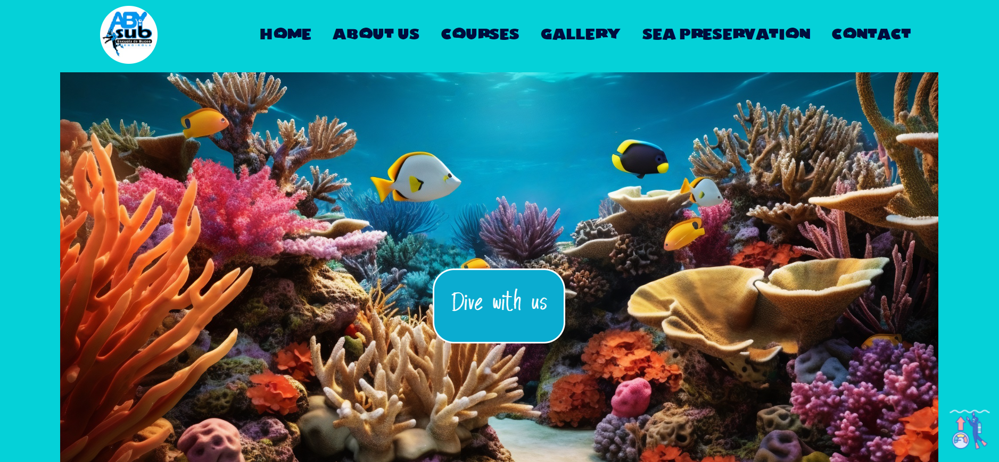
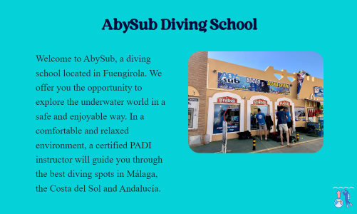
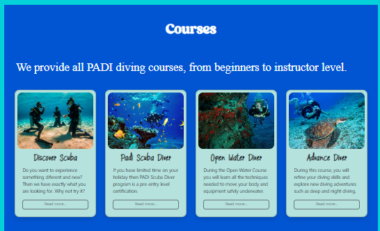
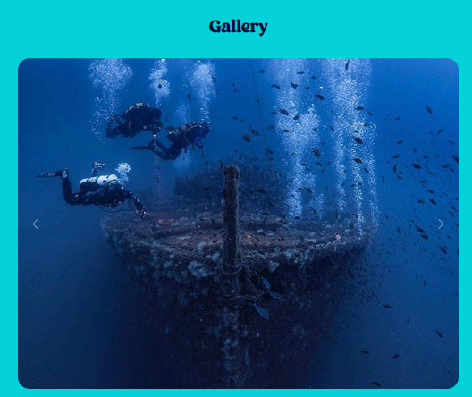
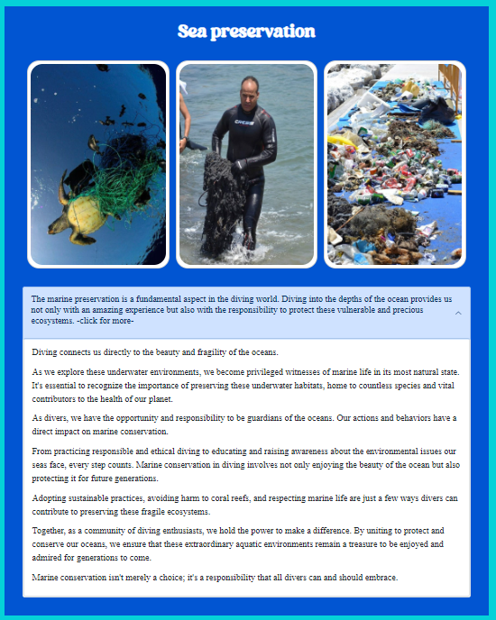
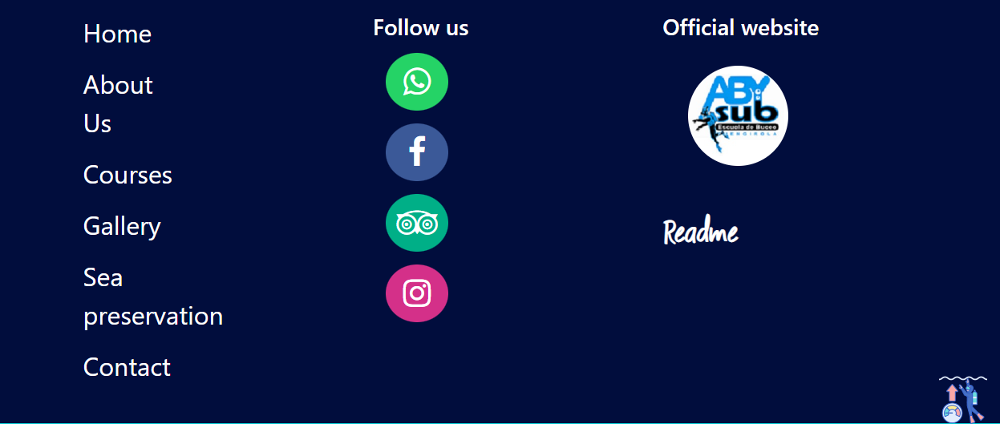

# ProyectoBuceo
 <h1>Memoria del proyecto de la primera de evaluación de Lenguajes de Marcas -  </h1>
 <h2> 1ero DAW 2023/24 Alan Turing, Málaga</h2>
<h2>Proyecto sobre buceo</h2>
<h2>Indice</h2>
<ul>
  <li><a href="#introduccion">Introducción</a></li>
  <li><a href="#motivacion">Motivación</a></li>
  <li><a href="#estructura">Estructura</a></li>
  <li><a href="#estilo">Estilo</a></li>
</ul>

<h2 id="introduccion">Introducción</h2>

Trabajo realizado en clase por: Colomer, Barbara P.

Proyecto de web "from scratch" de 1ª evaluación de Lenguajes de Marcas

Diciembre de 2023 

Licencia copyright

<h2 id="motivacion">Motivación</h2>

El tema lo he elegido porque el buceo me apasiona. La sensacion de respirar bajo el agua es maravillosa

<h2 id="estructura">Estructura</h2>

La web está dividida en  6 secciones:

<ul>
  <li>Hero Section / Home-Inicio </li>  
  <li>About us - Nosotros</li>
  <li>Courses - Cursos</li>
  <li>Gallery - Galería</li>  
  <li>Sea preservation - Conservacion marina</li>
  <li>Footer</li>
</ul>

<h3>Hero Section</h3>

He utilizado una imagen de fondo tomada de FreePik que se adapta fácilmente a diferentes dispositivos 
Sobre ella he colocado dos Call to Action, uno que te lleva a todas las secciones de la pagina en Ingles y otro que te lleva directamente a la seccion nosotros de la pagina en español.

<h3>About Us</h3>

He dispuesto en un grid de 2 columnas, uno con texto y otro con una imagen

<h3>Courses</h3>

He dispuesto en un grid de 4 columnas, con cards de imagen y texto

<h3>Gallery</h3>

Aqui hay un carrousel de 12 imagenes que se cambian cada 2 segundos y controles para poder avanzar, retroceder o ir a alguna imagen especifica con funciones de js

<h3>Sea preservation</h3>

Aqui hay un grid de 3 imagenes estaticas y un texto con un boton activo de read more con funciones de js para extender el texto en caso que se desee leerlo completo

<h3>About Us</h3>

El footer esta dividido en 3, una columna para las redes sociales, el link oficial de la pagina en la que he obtenido gran parte del contenido como fotofrafias y texto y una ventana modal para las atribuciones, en otra columna tengo una copia de la barra de navegacion y una tercer columna donde hay alojado el enlace a la ubicacion real de la Escuela de Buceo

<h2 id="estilo">Estilo de la página</h2>
<h3>Tipografías</h3>

Las tipografias las he obtenido de ffonts.net, 1001freefonts.com, y fontspace.com. En la ventana modal del footer estan los enlaces a las fuentes especificas utilizadas

<h3>Imágenes</h3>

La gran parte de las imagenes fueron obtenidas de las redes sociales de AbySub

<h3>Sonido</h3>

He añadido un sonido del ruido que se escucha cuando uno esta buceando, que suena solo cuando se pase el ratón sobre la HeroSection 

<h2 id="snippets">Code snippets</h2>

He utilizado code snippets obtenidos de Bootstrap:

<ul>
<li> Responsive Topnav</li>
<li> Carousel</li>
<li> Read More Read Less Button</li>
<li> Card</li>
<li> Contact form</li>
<li> Modal window</li>

</ul>

<h2>CREDITOS</h2>
                       

                        <h3>Imagenes</h3>
                        <ol>
                            <li> <a href="https://www.flaticon.es/icono-gratis/tortuga_7335393?term=tortuga+marina&page=1&position=10&origin=tag"
                                    target="_blank">Favicon</a>
                            </li>

                            <li>Paisaje submarino de Hero Section: Imagen de <a
                                    href="https://www.freepik.es/foto-gratis/paisaje-submarino_43464718.htm#query=coral&position=29&from_view=search&track=sph&uuid=e940d419-25bc-44d3-b5f2-aa47236142d4"
                                    target="_blank">Freepik</a>
                            </li>
                            <li>Imágenes de galería, de centro y de la sección de conservación marina: obtenidas
                                de la paginas
                                oficial de Abysub, Facebook e Instagram.</li>
                            <li>Imágenes de cursos:
                                <ul>
                                    <li> <a href="https://www.thesavvyglobetrotter.com/scuba-diving-bucket-list/"
                                            target="_blank">Buceador
                                            avanzado</a></li>
                                    <li> <a href="https://www.buceopedia.com/sobre-mi/" target="_blank">Bautismo
                                            de buceo</a></li>
                                    <li> <a href="https://turismo.euskadi.eus/es/top-viajes/bautismo-de-buceo-en-hondarribia/aa30-12378/es/"
                                            target="_blank">Open
                                            Water</a></li>
                                    <li> <a href="https://www.travelphant.com/4-amazing-scuba-diving-spots-in-egypt/"
                                            target="_blank">Padi
                                            Scuba</a>
                                    </li>

                                </ul>
                            </li>
                            <li> <a href="hhttps://iconos8.es/icon/AuK6L5Q1QcOz/ascent" target="_blank">Buzo-anchor</a>
                            </li>
                        </ol>
                        <h3>Fuentes</h3>
                        <ul>
                            <li> <a href="https://www.ffonts.net" target="_blank">Garamond y garamonb</a>
                            </li>
                            <li> <a href="https://www.1001freefonts.com/es/aima-duo.font" target="_blank">Aima
                                    duo</a>
                            </li>
                            <li> <a href="https://www.fontspace.com/lost-fish-font-f31048" target="_blank">Diving</a>
                            </li>
                            <li> <a href="https://www.1001freefonts.com/es/embolism-spark.font"
                                    target="_blank">Embolism</a>
                            </li>

                        </ul>

                        <h3>Sonidos</h3>
                        
Underwater ambience: Sound Effect from <a
                                href="https://pixabay.com/sound-effects/?utm_source=link-attribution&utm_medium=referral&utm_campaign=music&utm_content=6201"
                                target="_blank">Pixabay</a>
                        

                        <h3>Code Snippets</h3>
                        
obtenidos de w3schools

                        <ul>
                            <li> Responsive Topnav</li>
                            <li> Menu Icon</li>
                            <li> Read More Read Less Button</li>
                            <li> Slideshow</li>
                            <li> CSS/JS Modal</li>
                        </ul>
                        
Estilos de <a href="https://neumorphism.io" target="_blank">boton</a> 

                         
                        
Licencia copyright
